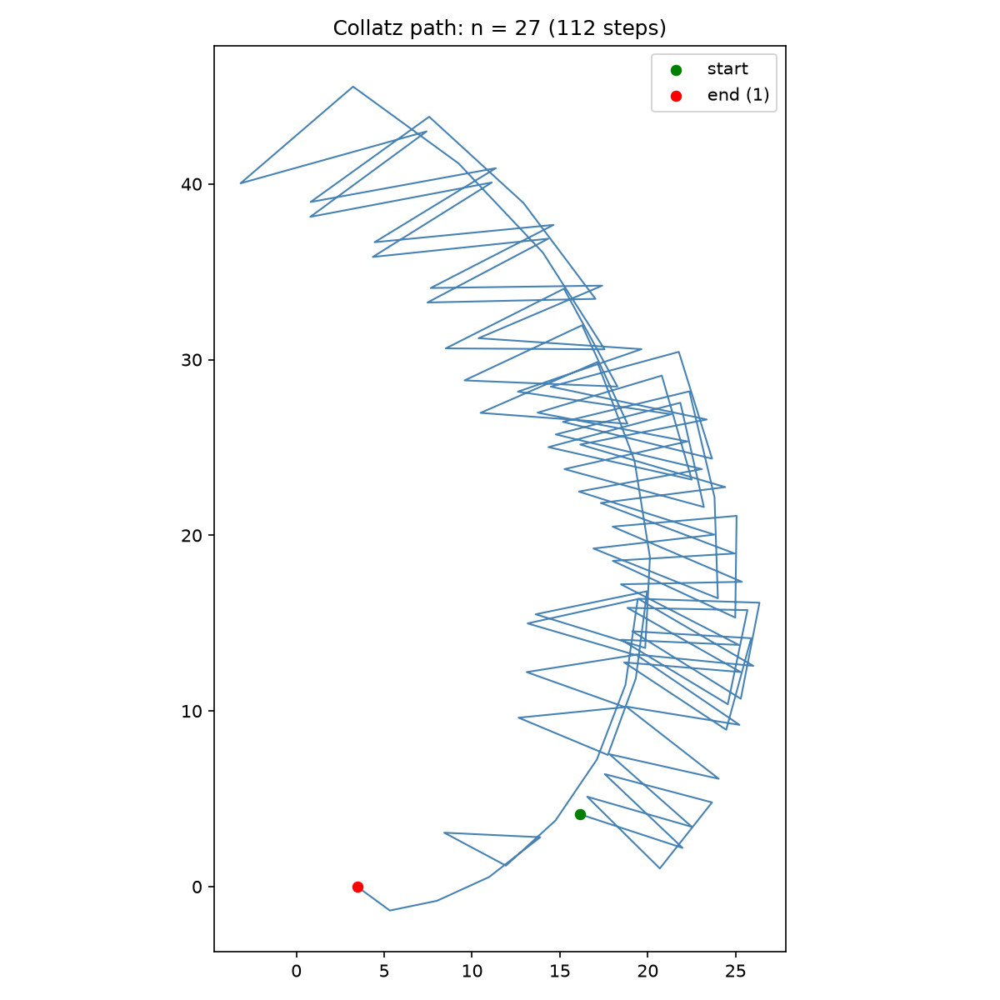
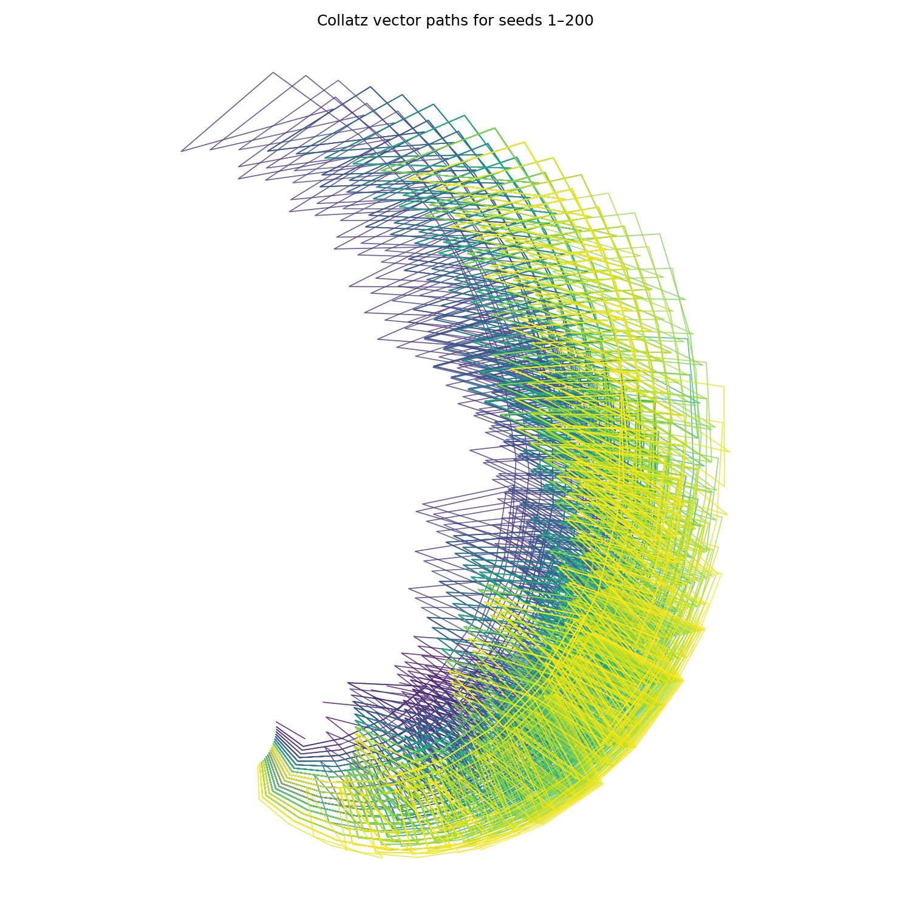

# Collatz Paths

A small Python visualizer that turns Collatz ("3n+1") trajectories into 2D spatial paths. Each step in a sequence becomes a point in the plane: odd steps (3n+1) and even steps (n/2) turn in opposite directions, and the radius grows logarithmically with the current value — producing the branching, coral-like patterns commonly associated with Collatz visualizations.

## Preview


*Trajectory for n = 27 — 112 steps, one of the most famous "surprisingly long" examples for small starting values.*


*Overlaid trajectories for seeds 1–200, colored by seed. All paths converge toward the origin as they reach 1.*


*10,000 trajectories rendered against a shared geometry cache — every occurrence of the same value maps to one fixed point in space regardless of which seed's path reaches it, fusing shared sub-paths into unified trunks rather than overlapping strands.*

## The Collatz Conjecture

For any positive integer n: if n is even, divide by 2; if n is odd, compute 3n+1. Repeat. The conjecture states every starting value eventually reaches 1. It remains unproven despite verification for all n up to very large bounds.

A companion project, [`collatz.sh`](https://github.com/Abhrankan-Chakrabarti/pari-gp-scripts), computes trajectory *statistics* (step counts, peak values) across a range of starting values from the command line via PARI/GP. This repo visualizes individual trajectories geometrically instead.

## Installation

```bash
git clone https://github.com/Abhrankan-Chakrabarti/collatz-paths.git
cd collatz-paths
pip install -r requirements.txt
```

`requirements.txt`:
```
numpy
matplotlib
```

## Usage

```bash
python collatz.py
```

By default this generates and saves `collatz_27.png` (a single path) and `collatz_bundle.png` (seeds 1–200 overlaid).

```python
from collatz import generate_collatz_vector_path, plot_single_path, plot_multiple_paths

# Just the coordinates, no plotting
path = generate_collatz_vector_path(27)

# Save a single trajectory plot
plot_single_path(97)

# Save an overlay of many trajectories
plot_multiple_paths(range(1, 501))
```

## API

### `generate_collatz_vector_path(start_num, alpha=0.25, beta=-0.15, scale=5.0)`

Computes the Collatz sequence for `start_num`, then maps it to 2D coordinates:

- **`alpha`** — angular turn (radians) applied on each odd step (3n+1)
- **`beta`** — angular turn (radians) applied on each even step (n/2); negative by default so odd and even steps curve in opposite directions
- **`scale`** — multiplier on the logarithmic radius `log(n+1) * scale`, controlling overall plot size

Returns an `(steps, 2)` NumPy array of `(x, y)` coordinates.

### `plot_single_path(start_num, ax=None, **kwargs)`

Plots one trajectory with start (green) and end-at-1 (red) markers. If `ax` is provided, draws onto an existing matplotlib axis instead of creating a new figure — useful for building custom grids of multiple plots. `**kwargs` are passed through to `generate_collatz_vector_path`.

### `plot_multiple_paths(seeds, **kwargs)`

Overlays trajectories for an iterable of seeds, colored by seed order via a viridis gradient. Saves `collatz_bundle.png`. `**kwargs` are passed through to `generate_collatz_vector_path`. Best for smaller seed ranges (up to a few hundred) where individual paths are still meant to be distinguishable.

### `compute_spatial_node(n, alpha=0.25, beta=-0.15, scale=5.0)`

Computes and caches the **absolute** angle and (x, y) position for value `n`, anchored to a fixed reference point at n=1 (theta=0, origin). Every value's position is computed once, relative to its parent in the Collatz chain, walking back to the nearest already-cached ancestor. This guarantees that whenever two different seeds' trajectories pass through the same value, they arrive at exactly the same point in space — producing a true shared tree.

Implemented iteratively rather than recursively: Python's default recursion limit (1000) can be exceeded by individual Collatz trajectories, which are empirically unbounded and reach into the thousands of steps for some starting values.

### `generate_cached_path(start_num, alpha=0.25, beta=-0.15, scale=5.0)`

Equivalent to `generate_collatz_vector_path`, but built on `compute_spatial_node`'s shared geometry cache (`GEOMETRY_CACHE`) instead of computing each path's angles independently. Faster and geometrically consistent across large seed batches — see note below on why this matters.

> **Note on an earlier caching approach:** a previous version cached each value's *relative* angular delta and accumulated it per-path via a running sum. Two different-length paths reaching the same value would accumulate different absolute angles, so the same number could land in different places depending on which path visited it — producing a denser but geometrically inconsistent image. Anchoring every value's angle to n=1 (as `compute_spatial_node` does) fixes this: shared values now always land at the same point.

### `plot_optimized_bundle(seeds, filename="collatz_galaxy.png", alpha=0.25, beta=-0.15, scale=5.0)`

Renders large seed bundles (thousands of seeds) using the shared geometry cache, a dark background, thin low-alpha lines, and an inferno colormap. Because shared values map to one fixed point, trajectories visually fuse into common trunks rather than forming separate near-overlapping strands. Best for large seed ranges (1000+) where the aggregate tree structure matters more than distinguishing individual trajectories.

```python
plot_optimized_bundle(range(1, 10001), alpha=0.21, beta=-0.13, scale=8.0)
# Saved collatz_galaxy.png (21664 unique structural nodes)
```

## Customizing the Look

Try different `alpha`/`beta` combinations for different visual signatures:

```python
plot_multiple_paths(range(1, 300), alpha=0.5, beta=-0.3, scale=3.0)
```

Larger `alpha`/`beta` magnitudes produce tighter spirals; a larger `scale` spreads the paths out more.

## License

MIT — see [LICENSE](LICENSE) for details.
